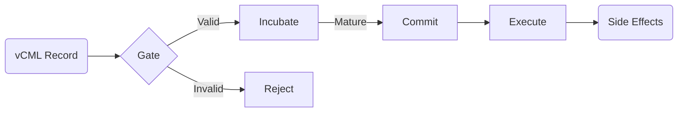

# CaPU (Causal Processing Unit)

**CaPU** is a permission-based causal engine for **Gate → Incubate → Commit → Execute** pipelines.


*(ASCII representation below if Mermaid is not rendered)*
```
[vCML Record] -> [GATE] -> (Valid?) -> [INCUBATE] -> (Mature?) -> [COMMIT] -> [EXECUTE] -> [Effects]
                         |
                         `-> [REJECT]
```

## What CaPU Is
*   **A Specification:** Defines the state machine and decision logic for processing causal records.
*   **Permission-First:** Focuses on *if* and *when* an action is allowed to happen.
*   **Modular:** Designed to work with interchangeable storage and execution backends.

## CaPU as a Device
CaPU can be seen as a **causal device** rather than a software module.
It accepts causes, not commands, and produces effects only when causally permitted.

## What CaPU Is Not
*   **Not a Transport:** It does not handle network sockets or delivery (see LPT).
*   **Not a Data Format:** It does not define the cause record structure (see vCML).
*   **Not a Logger:** It emits events to an interface, but the trace format is external (see T-Trace).

## Relation to Ecosystem
*   **vCML:** The input format. CaPU processes vCML records.
*   **LPT:** The transport layer. LPT delivers records to the CaPU boundary.
*   **T-Trace:** The observability layer. CaPU decisions and state transitions are recorded via T-Trace compatible sinks.
*   **Canonical ownership:** See [DEPENDENCIES.md](DEPENDENCIES.md) (do not re-implement vCML/LPT/T-Trace).

## Quickstart
> **Note:** This is a **spec-first** repository. There is no runtime implementation yet.

1.  Read [SPEC.md](SPEC.md) for the core architecture.
2.  Check [STATE_MACHINE.md](STATE_MACHINE.md) for the lifecycle logic.
3.  See [examples/](examples/) for JSONL flow examples.
4.  Review [DEPENDENCIES.md](DEPENDENCIES.md) for canonical links.
