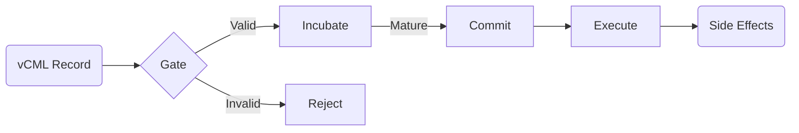

# CaPU (Causal Processing Unit)

CaPU is a permission-first runtime for Gate -> Incubate -> Commit -> Execute pipelines.

It is built for systems where an action should not execute merely because it was requested. An action should execute only after it has passed validation, satisfied maturity conditions, been durably committed, and preserved a traceable causal explanation.


```mermaid
graph LR
    Input(vCML Record) --> Gate{Gate}
    Gate -- Valid --> Incubate[Incubate]
    Gate -- Invalid --> Reject[Reject]
    Incubate -- Mature --> Commit[Commit]
    Commit --> Execute[Execute]
    Execute --> Effect(Side Effects)
```

ASCII fallback:

```text
[vCML Record] -> [GATE] -> (Valid?) -> [INCUBATE] -> (Mature?) -> [COMMIT] -> [EXECUTE] -> [Effects]
                         |
                         `-> [REJECT]
```

## What CaPU Is

- A specification for permissioned causal execution.
- A state machine for deciding whether a cause should be rejected, held, committed, executed, or expired.
- A reference runtime for deterministic validation experiments.
- A device-boundary model with stable ports for causes, permissions, effects, and trace events.

## Why This Matters

In agentic and tool-using systems, unsafe behavior is often not just bad output. It can also mean:

- executing before required context is available
- skipping a maturity condition
- emitting side effects without durable commit
- losing the reason why an effect was permitted
- making runtime decisions that cannot be reconstructed later

CaPU addresses that execution-runtime layer.

It is useful when you need:

- execution only after a permit decision
- holding behavior for unmet preconditions instead of premature execution
- commit-before-effect guarantees
- reproducible decision codes and trace events for post-hoc review

## CaPU as a Device

CaPU can be understood as a causal device rather than only a software module.
It accepts causes, not commands, and produces effects only when causally permitted.

## Device Ports

Ports define the device boundary. See [ports/README.md](ports/README.md) for the full index, or jump directly to each contract:

- [CauseIn](ports/cause_in.md)
- [PermissionOut](ports/permission_out.md)
- [EffectOut](ports/effect_out.md)
- [TraceOut](ports/trace_out.md)

## What CaPU Is Not

- Not a transport layer.
- Not a data format.
- Not a logger.
- Not a full safety stack.

CaPU does not replace policy design, model evaluation, sandboxing, or external security controls. It is the permission and maturity runtime for execution.

## Relation to Ecosystem

- vCML: input record semantics.
- LPT: transport to the CaPU boundary.
- T-Trace: observability surface for runtime decisions and transitions.
- Canonical ownership: see [DEPENDENCIES.md](DEPENDENCIES.md).

## Validation Surface

This repository includes a deterministic validation path:

- schema validation for port examples
- reference runtime behavior checks
- golden fixture verification
- tracked validation snapshot in [VALIDATION_RESULTS.md](VALIDATION_RESULTS.md)

This gives the project a visible proof-of-behavior layer instead of relying only on prose.

## Threat Model Fit

CaPU is most useful for failures in permissioned execution pipelines, for example:

- executing before a cause is mature
- producing side effects without durable commit
- failing to defer when parent context is missing
- losing explainability around accept, hold, reject, expire, or execute outcomes
- allowing action flow without a stable device boundary and trace contract

For broader framing, see [docs/safety/agentic_execution_threat_model.md](docs/safety/agentic_execution_threat_model.md).

## Quickstart

Note: this remains a spec-first repository, but it now includes a minimal in-memory reference runtime for demos and validation experiments.

1. Run `npm install`.
2. Read [SPEC.md](SPEC.md) for the core architecture.
3. Check [STATE_MACHINE.md](STATE_MACHINE.md) for the lifecycle logic.
4. See [examples/](examples/) for JSONL flow examples.
5. Review [DEPENDENCIES.md](DEPENDENCIES.md) for canonical links.
6. Run `npm run demo:reference` to see the reference runtime produce decisions, effects, and trace events.
7. Run `npm run test:reference` to verify the reference runtime paths, including commit failures.
8. Run `npm run verify:golden` to compare the reference runtime output against the golden fixture.
9. Run `npm test` to execute the full local validation pipeline.
10. Run `npm run report:validation` to regenerate [VALIDATION_RESULTS.md](VALIDATION_RESULTS.md).