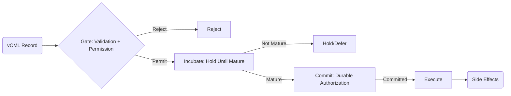

# CaPU (Causal Processing Unit)

[](https://github.com/safal207/CaPU/actions/workflows/cmc-rust.yml)

CaPU is a permission-first execution runtime for high-risk actions.

It ensures that side effects occur only after validation, maturity checks, durable commit, and reproducible causal justification. A requested action is not enough; execution must be causally permitted before effects are allowed to occur.

CaPU is most relevant when actions can produce costly, irreversible, or security-sensitive effects.


```mermaid
graph LR
    Input(vCML Record) --> Gate{Gate: Validation + Permission}
    Gate -- Reject --> Reject[Reject]
    Gate -- Permit --> Incubate[Incubate: Hold Until Mature]
    Incubate -- Not Mature --> Hold[Hold/Defer]
    Incubate -- Mature --> Commit[Commit: Durable Authorization]
    Commit -- Committed --> Execute[Execute]
    Execute --> Effect(Side Effects)
```

ASCII fallback:

```text
[vCML Record] -> [GATE] -> (Permitted?) -> [INCUBATE] -> (Mature?) -> [COMMIT] -> [EXECUTE] -> [Side Effects]
                      |                      |
                      +-> [REJECT]          +-> [HOLD / DEFER]
```

## Review links

- Interactive progress dashboard: [docs/hardware/CAPU_PROGRESS_DASHBOARD.html](docs/hardware/CAPU_PROGRESS_DASHBOARD.html)
- Public status and roadmap snapshot: [docs/hardware/CAPU_PUBLIC_STATUS_AND_ROADMAP.md](docs/hardware/CAPU_PUBLIC_STATUS_AND_ROADMAP.md)
- CaPU software reference units status: [docs/hardware/CAPU_SOFTWARE_REFERENCE_UNITS_STATUS.md](docs/hardware/CAPU_SOFTWARE_REFERENCE_UNITS_STATUS.md)
- CaPU processor model: [docs/hardware/CAPU_PROCESSOR_MODEL.md](docs/hardware/CAPU_PROCESSOR_MODEL.md)
- CaPU semantic ISA v0: [docs/hardware/CAPU_PROCESSOR_ISA_V0.md](docs/hardware/CAPU_PROCESSOR_ISA_V0.md)
- CaPU microarchitecture v0: [docs/hardware/CAPU_MICROARCHITECTURE_V0.md](docs/hardware/CAPU_MICROARCHITECTURE_V0.md)
- CaPU legitimacy coprocessor brief: [docs/hardware/CAPU_LEGITIMACY_COPROCESSOR_BRIEF.md](docs/hardware/CAPU_LEGITIMACY_COPROCESSOR_BRIEF.md)
- CaPU software reference units roadmap: [docs/hardware/CAPU_SOFTWARE_REFERENCE_UNITS_ROADMAP.md](docs/hardware/CAPU_SOFTWARE_REFERENCE_UNITS_ROADMAP.md)
- CMC current reviewer path: [docs/hardware/CMC_CURRENT_REVIEWER_PATH.md](docs/hardware/CMC_CURRENT_REVIEWER_PATH.md)
- CMC persona/action reviewer path: [docs/hardware/CMC_PERSONA_ACTION_REVIEWER_PATH.md](docs/hardware/CMC_PERSONA_ACTION_REVIEWER_PATH.md)
- Why causal computation: [docs/hardware/WHY_CAUSAL_COMPUTATION.md](docs/hardware/WHY_CAUSAL_COMPUTATION.md)
- Causal execution architecture: [docs/hardware/CAUSAL_EXECUTION_ARCHITECTURE.md](docs/hardware/CAUSAL_EXECUTION_ARCHITECTURE.md)
- CMC evidence map: [docs/hardware/CMC_EVIDENCE_MAP.md](docs/hardware/CMC_EVIDENCE_MAP.md)
- CMC reviewer quickstart: [docs/hardware/CMC_REVIEWER_QUICKSTART.md](docs/hardware/CMC_REVIEWER_QUICKSTART.md)
- CMC baseline status: [docs/hardware/CMC_BASELINE_STATUS.md](docs/hardware/CMC_BASELINE_STATUS.md)
- CMC Phase 2 roadmap: [docs/hardware/CMC_PHASE_2_ROADMAP.md](docs/hardware/CMC_PHASE_2_ROADMAP.md)
- CMC invariants: [docs/hardware/CMC_INVARIANTS.md](docs/hardware/CMC_INVARIANTS.md)
- Device vision: [docs/DEVICE_VISION.md](docs/DEVICE_VISION.md)
- Hardware roadmap: [docs/HARDWARE_ROADMAP.md](docs/HARDWARE_ROADMAP.md)
- Causal Memory Controller thesis: [docs/hardware/CAUSAL_MEMORY_CONTROLLER.md](docs/hardware/CAUSAL_MEMORY_CONTROLLER.md)
- CMC replay model: [docs/hardware/CMC_REPLAY.md](docs/hardware/CMC_REPLAY.md)
- CMC hash-chain sketch: [docs/hardware/CMC_HASH_CHAIN.md](docs/hardware/CMC_HASH_CHAIN.md)
- CMC TraceOut spec: [docs/hardware/CMC_TRACEOUT.md](docs/hardware/CMC_TRACEOUT.md)
- CMC investor one-pager: [docs/hardware/CMC_INVESTOR_ONE_PAGER.md](docs/hardware/CMC_INVESTOR_ONE_PAGER.md)
- CMC Rust simulator: [rust/cmc-core/README.md](rust/cmc-core/README.md)
- Grant evidence: [docs/GRANT_EVIDENCE.md](docs/GRANT_EVIDENCE.md)
- Validation snapshot: [VALIDATION_RESULTS.md](VALIDATION_RESULTS.md)
- Runtime state machine: [STATE_MACHINE.md](STATE_MACHINE.md)
- Dependency boundaries: [DEPENDENCIES.md](DEPENDENCIES.md)
- Threat model: [docs/safety/agentic_execution_threat_model.md](docs/safety/agentic_execution_threat_model.md)

## Core Concepts and Architecture

The shortest conceptual entrypoint is:

```text
Traditional computing verifies state transitions.
Causal computing verifies transition legitimacy.
```

CaPU/CMC treats legitimacy as something that should be represented, replayed, and checked near execution and memory/effect boundaries.

Recommended reviewer path:

```text
CAPU_PROGRESS_DASHBOARD
 -> CAPU_PUBLIC_STATUS_AND_ROADMAP
 -> CAPU_SOFTWARE_REFERENCE_UNITS_STATUS
 -> CAPU_PROCESSOR_MODEL
 -> CAPU_PROCESSOR_ISA_V0
 -> CAPU_MICROARCHITECTURE_V0
 -> CAPU_LEGITIMACY_COPROCESSOR_BRIEF
 -> CAPU_SOFTWARE_REFERENCE_UNITS_ROADMAP
 -> CMC_CURRENT_REVIEWER_PATH
 -> CMC_PERSONA_ACTION_REVIEWER_PATH
 -> WHY_CAUSAL_COMPUTATION
 -> CAUSAL_EXECUTION_ARCHITECTURE
 -> CAUSAL_MEMORY_CONTROLLER
 -> CMC_REPLAY
 -> CMC_HASH_CHAIN
 -> CMC_EVIDENCE_MAP
 -> CMC_REVIEWER_QUICKSTART
 -> CMC_BASELINE_STATUS
 -> CMC_PHASE_2_ROADMAP
 -> CMC_INVARIANTS
 -> rust/cmc-core
 -> CMC GitHub Actions
```

Core distinction:

```text
Blockchain protects transaction history.
CMC protects causal legitimacy.
```

The emerging primitive is:

```text
legitimate transition history
```

Not only what changed, but whether the change had the right to happen.

## Why CaPU Exists

Many systems can validate or describe actions, but still allow execution to happen too early. CaPU exists to prevent side effects from occurring before permission, maturity, and durable commit conditions have been satisfied.

## What CaPU Is

- A permission-first execution runtime for controlling whether actions may progress toward side effects.
- An execution state machine for the hold / reject / commit / execute lifecycle.
- The execution-control layer that enforces commit-before-effect guarantees.
- A deterministic runtime that produces reproducible decision codes and traceable transitions.

## Runtime Pipeline (Central Guarantee)

CaPU's core pipeline is **Gate -> Incubate -> Commit -> Execute**:

- **Gate:** Validate the record and make the permission decision.
- **Incubate:** Hold/defer until maturity and preconditions are satisfied.
- **Commit:** Durably authorize the decision before any side effects can occur.
- **Execute:** Allow side effects only after prior stages have succeeded.

This pipeline makes **commit-before-effect** the default runtime behavior, not a best-effort convention.

## Commit-Before-Effect Identity

CaPU is designed for systems where side effects must not happen before durable commit. If commit fails or preconditions are unresolved, execution does not proceed.

## Device Metaphor (Secondary)

CaPU can be understood as a device boundary with stable ports, but this is secondary to its practical role as an execution runtime.

## Causal Memory Controller (CMC)

CaPU now includes an early research branch for **Causal Memory Controller (CMC)**.

The thesis is simple:

```text
Ordinary memory stores what changed.
Causal Memory stores why the change was allowed.
```

CMC explores whether causal metadata can be preserved near memory and controller boundaries so agentic systems keep continuity across:

```text
context -> permission -> action -> memory write -> later effect
```

This is the README entrypoint. More detailed reviewer evidence lives under `docs/hardware/`.
