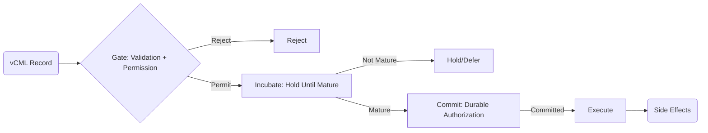

# CaPU (Causal Processing Unit)

CaPU is a permission-first execution runtime for high-risk actions.

It ensures that side effects occur only after validation, maturity checks, durable commit, and reproducible causal justification. A requested action is not enough; execution must be causally permitted before effects are allowed to occur.

CaPU is most relevant when actions can produce costly, irreversible, or security-sensitive effects.


```mermaid
graph LR
    Input(vCML Record) --> Gate{Gate: Validation + Permission}
    Gate -- Reject --> Reject[Reject]
    Gate -- Permit --> Incubate[Incubate: Hold Until Mature]
    Incubate -- Not Mature --> Hold[Hold/Defer]
    Incubate -- Mature --> Commit[Commit: Durable Authorization]
    Commit -- Committed --> Execute[Execute]
    Execute --> Effect(Side Effects)
```

ASCII fallback:

```text
[vCML Record] -> [GATE] -> (Permitted?) -> [INCUBATE] -> (Mature?) -> [COMMIT] -> [EXECUTE] -> [Side Effects]
                      |                      |
                      +-> [REJECT]          +-> [HOLD / DEFER]
```

## Why CaPU Exists

Many systems can validate or describe actions, but still allow execution to happen too early. CaPU exists to prevent side effects from occurring before permission, maturity, and durable commit conditions have been satisfied.

## What CaPU Is

- A permission-first execution runtime for controlling whether actions may progress toward side effects.
- An execution state machine for the hold / reject / commit / execute lifecycle.
- The execution-control layer that enforces commit-before-effect guarantees.
- A deterministic runtime that produces reproducible decision codes and traceable transitions.

## Runtime Pipeline (Central Guarantee)

CaPU's core pipeline is **Gate -> Incubate -> Commit -> Execute**:

- **Gate:** Validate the record and make the permission decision.
- **Incubate:** Hold/defer until maturity and preconditions are satisfied.
- **Commit:** Durably authorize the decision before any side effects can occur.
- **Execute:** Allow side effects only after prior stages have succeeded.

This pipeline makes **commit-before-effect** the default runtime behavior, not a best-effort convention.

## Commit-Before-Effect Identity

CaPU is designed for systems where side effects must not happen before durable commit. If commit fails or preconditions are unresolved, execution does not proceed.

## Device Metaphor (Secondary)

CaPU can be understood as a device boundary with stable ports, but this is secondary to its practical role as an execution runtime.

## Device Ports

Ports define the execution boundary. See [ports/README.md](ports/README.md) for the full index, or jump directly to each contract:

- [CauseIn](ports/cause_in.md)
- [PermissionOut](ports/permission_out.md)
- [EffectOut](ports/effect_out.md)
- [TraceOut](ports/trace_out.md)

## What CaPU Is Not

- Not a transport layer.
- Not just a data format.
- Not just a logger.
- Not the full safety stack.

CaPU does not replace policy design, model evaluation, sandboxing, or external security controls. It is the execution-control runtime that decides whether side effects may occur.

## Relation to Ecosystem

- **CML / vCML:** Causal and authorization record semantics used as runtime input.
- **LTP:** Transport, oversight, replay, and admissibility inspection around the execution boundary.
- **T-Trace:** Observability surface for runtime decisions and transitions.
- **DRP / DMP:** Governance policy and durable decision memory outside the CaPU runtime.
- **CaPU:** Execution runtime that decides whether requested actions may progress to side effects.
- Canonical ownership and boundaries: see [DEPENDENCIES.md](DEPENDENCIES.md).

## Validation Surface

This repository includes a deterministic validation path:

- schema validation for port examples
- reference runtime behavior checks
- golden fixture verification
- tracked validation snapshot in [VALIDATION_RESULTS.md](VALIDATION_RESULTS.md)

This gives the project a visible proof-of-behavior layer instead of relying only on prose.

## Threat Model Fit

CaPU is most useful for failures in permissioned execution pipelines, for example:

- executing before a cause is mature
- producing side effects without durable commit
- failing to defer when parent context is missing
- losing explainability around accept, hold, reject, expire, or execute outcomes
- allowing action flow without a stable execution boundary and trace contract

For broader framing, see [docs/safety/agentic_execution_threat_model.md](docs/safety/agentic_execution_threat_model.md).

## Quickstart

Note: this is a spec-led repository that now includes a minimal in-memory reference runtime for demos and validation experiments.

1. Run `npm install`.
2. Read [SPEC.md](SPEC.md) for the core architecture.
3. Check [STATE_MACHINE.md](STATE_MACHINE.md) for the lifecycle logic.
4. See [examples/](examples/) for JSONL flow examples.
5. Review [DEPENDENCIES.md](DEPENDENCIES.md) for canonical links.
6. Run `npm run demo:reference` to see the reference runtime produce decisions, effects, and trace events.
7. Run `npm run test:reference` to verify the reference runtime paths, including commit failures.
8. Run `npm run verify:golden` to compare the reference runtime output against the golden fixture.
9. Run `npm test` to execute the full local validation pipeline.
10. Run `npm run report:validation` to regenerate [VALIDATION_RESULTS.md](VALIDATION_RESULTS.md).
