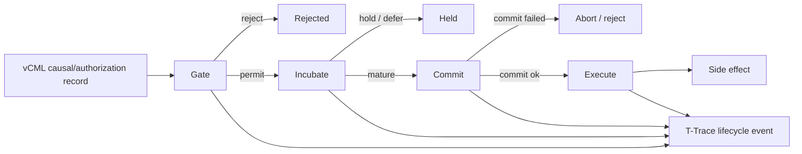

# Grant Evidence Package

Status: reviewer-facing evidence package.

Scope: this document summarizes the current CaPU artifact, reproducible reviewer path, evidence assets, explicit non-claims, and near-term roadmap for grant reviewers and technical evaluators.

## One-sentence claim

CaPU is a permission-first execution-control runtime for high-risk actions: it prevents side effects from occurring until validation, maturity checks, durable commit, and traceable causal justification have succeeded.

## Core idea

CaPU controls the transition from proposed action to side effect.

```text
vCML record -> Gate -> Incubate -> Commit -> Execute -> side effect
```

The central guarantee is commit-before-effect:

```text
No EXECUTE before successful durable COMMIT.
```

## Why this matters

Many systems can validate an action, log an action, or describe why an action looks reasonable, but still execute too early.

CaPU addresses a narrower runtime failure class:

- executing before permission is granted,
- executing before required parent context is mature,
- executing before durable commit,
- allowing rejected records to reach side effects,
- losing the runtime reason for accept/hold/reject/expire/execute outcomes.

CaPU exists to make side-effect progression explicit, deterministic, and traceable.

## Reviewer path

Install dependencies:

```bash
npm install
```

Run the reference demo:

```bash
npm run demo:reference
```

Run reference runtime tests:

```bash
npm run test:reference
```

Verify golden fixture output:

```bash
npm run verify:golden
```

Run the full local validation pipeline:

```bash
npm test
```

Regenerate validation report:

```bash
npm run report:validation
```

## Architecture at a glance



## Current evidence matrix

| Evidence asset | Reviewer question | Path / command | Current status |
| --- | --- | --- | --- |
| Core spec | Is the Gate -> Incubate -> Commit -> Execute lifecycle documented? | `SPEC.md`, `STATE_MACHINE.md` | Documented |
| Decision codes | Are runtime outcomes standardized? | `DECISION_CODES.md` | Documented |
| Port contracts | Is the execution boundary explicit? | `ports/` | Documented |
| Reference runtime | Does the repo contain executable behavior? | reference runtime files + `npm run demo:reference` | Implemented |
| Runtime tests | Are reject/hold/commit/execute paths checked? | `npm run test:reference` | Implemented |
| Golden fixture | Is output reproducible against expected artifact? | `npm run verify:golden` | Implemented |
| Full validation | Is there a local validation pipeline? | `npm test` | Implemented |
| Validation snapshot | Is behavior summarized for reviewers? | `VALIDATION_RESULTS.md` | Documented |
| Dependency boundaries | Are responsibilities separated from CML/LTP/T-Trace/DRP/DMP? | `DEPENDENCIES.md` | Documented |

## What is already implemented

- Spec-led CaPU lifecycle.
- State machine for received, validating, held, accepted, committed, executed, rejected, expired, and failed paths.
- Standardized decision codes.
- Port contracts for CauseIn, PermissionOut, EffectOut, and TraceOut.
- Minimal in-memory reference runtime.
- Reference runtime demo.
- Reference runtime tests, including commit failure behavior.
- Golden fixture verification.
- Validation report generation.
- Dependency boundary documentation.

## Core invariants

CaPU is organized around runtime invariants:

```text
EXECUTE must only occur after COMMIT.
REJECT never leads to EXECUTE.
HOLD/DEFER reaches commit eligibility only when preconditions are satisfied.
Runtime decisions must be explainable via decision codes.
```

These invariants are what make CaPU different from a normal action queue or logger.

## What CaPU makes inspectable

CaPU is designed to make side-effect progression inspectable, including:

- whether a record was structurally valid,
- whether permission was granted or denied,
- whether the record was held for unmet preconditions,
- whether maturity conditions were satisfied,
- whether durable commit succeeded,
- whether execution was allowed,
- which decision code explains the runtime outcome,
- which trace events were emitted along the lifecycle.

## Relationship to the Liminal Evidence Stack

CaPU fills the execution-control gap between decision/gating and real-world side effects.

- **PythiaLabs:** evaluates proposed high-risk actions before tool calls.
- **CaPU:** controls whether a permitted action may progress to side effects.
- **DRP:** records decisions and supersession relationships.
- **DMP:** preserves consequence-bearing governance memory and reversibility drift.
- **LTP:** provides replay/admissibility/oversight around execution boundaries.
- **T-Trace:** provides canonical trace/event format for acknowledged transitions.
- **CML / vCML:** provides causal and authorization record semantics.
- **TTM DB:** preserves immutable ground-truth transition traces.
- **LiminalDB:** stores adaptive timelines, snapshots, and derived evidence views.

Short version:

```text
PythiaLabs decides before action.
CaPU controls commit-before-effect.
T-Trace/LTP make the path inspectable.
CML audits causal validity.
DRP/DMP preserve decision and consequence memory.
TTM DB/LiminalDB preserve trace and evidence substrate.
```

## What this project does not claim yet

CaPU currently does not claim:

- complete AI alignment,
- universal policy correctness,
- production sandboxing by itself,
- replacement of IAM, security controls, or external authorization systems,
- replacement of model evaluation or red teaming,
- guaranteed prevention of all unsafe actions,
- distributed consensus or production-grade durable storage by itself,
- full production runtime maturity.

The current value is narrower: a spec-led and reference-runtime artifact for deterministic side-effect control with commit-before-effect semantics.

## Why this is grant-relevant

Agentic AI safety is not only about final answers. It is also about whether systems are allowed to cause effects.

CaPU contributes one safety primitive:

```text
permission + maturity + durable commit -> execution eligibility
```

This supports research into high-risk tool use, autonomous coding changes, infrastructure actions, financial operations, governance workflows, and any agentic system where side effects must not occur prematurely.

## Research / build roadmap

Near-term work can focus on:

1. **Runtime conformance fixtures** — expand accepted/held/rejected/expired/commit-failed scenarios.
2. **Durable commit adapters** — define storage boundaries for append-only commit backends.
3. **Trace sink adapter** — emit lifecycle events into T-Trace/LTP-compatible artifacts.
4. **Policy hook boundary** — formalize external policy inputs without making CaPU a policy engine.
5. **PythiaLabs bridge** — feed pre-execution gate decisions into CaPU execution control.
6. **CML bridge** — use vCML/CML records as runtime input and audit lineage after execution attempts.
7. **Reviewer reports** — generate one report showing decision code, lifecycle path, commit status, and execution eligibility.

## Suggested reviewer checklist

A reviewer can ask:

- Can I run the reference runtime demo?
- Can I run tests and golden verification?
- Is execution forbidden before commit?
- Are reject/hold/commit-fail paths represented?
- Are responsibilities separated from CML, LTP, T-Trace, DRP, and DMP?
- Are non-claims explicit?
- Is the side-effect-control role clear?

## Current strongest positioning

Use this formulation in applications:

```text
CaPU is a permission-first execution-control runtime for high-risk agentic actions. It enforces a Gate -> Incubate -> Commit -> Execute lifecycle so side effects occur only after permission, maturity, durable commit, and traceable causal justification.
```

## Short version

```text
CaPU is the commit-before-effect layer.
A requested action is not enough to execute.
```
