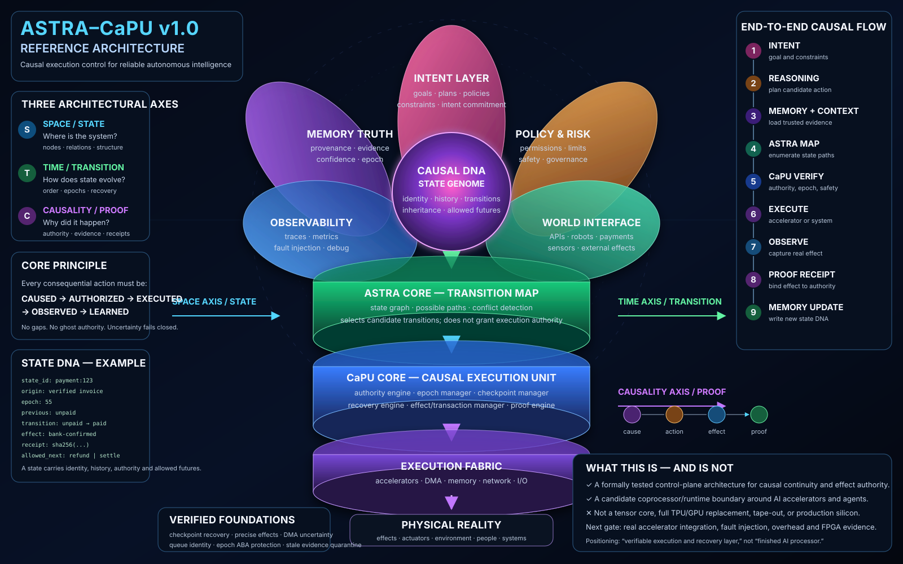

# ASTRA–CaPU v1.0 Reference Architecture

Status: **reference architecture and qualification plan**.

This document lifts the verified CaPU recovery and effect-authority line into a coherent candidate architecture for reliable autonomous-AI execution.

It is intentionally precise about the boundary:

```text
This is not a completed TPU/GPU replacement or tape-out-ready processor.

It is a candidate causal-control coprocessor/runtime boundary
for verifiable execution, recovery, and consequential effects.
```



---

## One-sentence thesis

Future autonomous-AI systems need a control layer that can prove **which state and authority permitted an action, which effect actually occurred, and how execution may safely continue after failure**.

---

## The architectural split

ASTRA, CaPU, and Causal DNA have different responsibilities.

```text
Causal DNA
= what this state is
+ where it came from
+ what evidence and authority it carries
+ which futures remain admissible

ASTRA
= which state transitions are possible
+ how transitions relate in space and time
+ which paths conflict

CaPU
= which proposed transition is authorized to execute
+ how its effect is identified
+ how recovery remains fail-closed
+ which proof receipt closes the transition
```

Compactly:

```text
Causal DNA asks:  what state is this?
ASTRA asks:       where can it go?
CaPU asks:        does it have the right to go there?
Execution asks:   what physically happened?
Proof asks:       what evidence now becomes authoritative?
```

A possible transition is not automatically an authorized transition.

---

## Position in the compute stack

```text
Human / service intent
        ↓
Agent / planner / compiler-runtime
        ↓
ASTRA transition map
        ↓
CaPU causal execution control
        ↓
GPU / TPU / NPU / DMA / network / I/O
        ↓
Memory or external effect
        ↓
Proof receipt and recovered state
```

CaPU is not intended to replace matrix multiplication, tensor scheduling, cache hierarchies, or accelerator interconnects.

Its candidate role is to sit beside or around those mechanisms as a **control-plane authority boundary**.

---

## Three architectural axes

### Space / state

Describes:

```text
objects
relations
memory locations
dependencies
transaction slots
accelerator contexts
visible owners
```

Question:

```text
Where is the system in the modeled state space?
```

### Time / transition

Describes:

```text
ordering
epochs
incarnations
attempts
retries
checkpoint freshness
retirement
recovery
identity reuse
```

Question:

```text
How did the system reach this state, and what may happen next?
```

### Causality / proof

Describes:

```text
intent
authority
command identity
effect identity
evidence
receipt
claim boundary
```

Question:

```text
Why was this transition allowed, and what proves the observed outcome?
```

---

## Architectural layers

### Intent layer

Inputs:

```text
goal
plan
constraints
policy context
expected outcome
```

The intent layer creates a stable reference for an action proposal. It does not by itself authorize execution.

A future intent commitment should minimally bind:

```text
intent_id
principal_id
policy_version
input/state commitment
expected effect class
expiry / epoch
```

### Memory Truth layer

The Memory Truth layer distinguishes ambient context from memory that is allowed to influence action authority.

A trusted memory object should carry:

```text
memory_id
source
state epoch / incarnation
provenance
confidence or evidence state
prior outcome linkage
authority scope
```

This does not claim that confidence automatically becomes truth. It makes the evidence boundary inspectable.

### Policy and Risk layer

Determines which rules must be checked before a transition may execute:

```text
principal permissions
value limits
resource boundaries
allowed effect class
human approval requirement
safety interlock
expiry / freshness
```

### Observability layer

Captures information required to reproduce and challenge a claimed transition:

```text
trace IDs
checkpoint IDs
epoch / incarnation / attempt IDs
accepted and rejected decisions
fault-injection points
receipt references
latency and resource cost
```

Observability is evidence collection, not authority by itself.

### World Interface layer

Connects the control plane to consequential effects:

```text
API mutation
payment
robot command
laboratory action
storage write
DMA transaction
network-visible operation
```

It must return discriminating evidence rather than only a success-shaped response.

### Causal DNA / state genome

Causal DNA is the canonical state/evidence record carried across transitions.

A candidate minimal schema is:

```text
state_id
state_commitment
parent_state_id
transition_id
principal / authority identity
queue incarnation and epoch
execution epoch and attempt
observed effect commitment
receipt commitment
allowed next-transition class
```

“DNA” is architectural shorthand. It does not imply biological behavior or self-modifying silicon.

### ASTRA transition map

ASTRA represents candidate transitions and their relations:

```text
current state
→ candidate paths
→ dependencies
→ conflicts
→ admissible next states
```

ASTRA may identify a possible path, but it does not grant execution authority.

### CaPU causal execution unit

The CaPU control core composes:

```text
authority engine
epoch / incarnation manager
checkpoint manager
recovery engine
transaction/effect manager
proof-receipt manager
```

Core rule:

```text
No consequential effect obtains authority merely because it was requested,
started, retried, observed, or remembered.
```

### Execution fabric

Performs ordinary computation and I/O:

```text
accelerator command queues
DMA
memory hierarchy
network
storage
robot or API interfaces
```

CaPU constrains authority around this fabric. It does not claim to implement the fabric in full.

---

## End-to-end causal flow

```text
1. INTENT
   human, service, or agent defines a goal and constraints

2. REASONING
   planner proposes a transition

3. MEMORY + CONTEXT
   trusted evidence and current state are loaded

4. ASTRA MAP
   possible transitions and conflicts are enumerated

5. CaPU VERIFY
   state, authority, epoch/incarnation, identity, policy, and recovery conditions are checked

6. EXECUTE
   accelerator or external system performs the authorized operation

7. OBSERVE
   the real effect or completion uncertainty is captured

8. PROOF RECEIPT
   discriminating evidence is bound to the exact transaction/effect identity

9. MEMORY UPDATE
   a new state commitment becomes eligible to influence later decisions
```

The intended closed loop is:

```text
CAUSED
→ AUTHORIZED
→ EXECUTED
→ OBSERVED
→ LEARNED
```

---

## Verified foundation

The v0.x sequence is not a full processor, but it is more than a presentation concept.

### Causal and architectural recovery

Bounded executable/formal models cover:

```text
checkpoint authority and anti-rollback
canonical checkpoint content binding
causal head / generation / seal recovery
PC, register, status, and privilege-state recovery
trap and nested delegation state
MMU/TLB freshness and shootdown authority
```

### Distributed authority

Bounded models cover:

```text
multi-hart acknowledgement quorum
unreliable delivery and retry provenance
cross-generation stale-message quarantine
generation-wrap ABA protection
```

### Accelerator effects and transaction identity

Bounded models cover:

```text
exactly-once DMA effect recovery
UNKNOWN completion preservation
durable negative completion evidence
partial and multi-beat DMA recovery
out-of-order and overlapping fragments
concurrent queue ordering
durable transaction-slot identity
cross-epoch slot reuse / ABA protection
queue-epoch wrap protected by authority incarnation
```

## Current verified milestone

The current verified implementation milestone beneath this architecture is:

```text
CaPU v0.33 — Queue-Epoch Wrap / Authority Incarnation
PR #87
exact head: f9d3832d84dc2415617a782cb226af83943b5ecd
safety BMC depth: 24
cover depth: 44
cover witnesses: 4
RESONANCE Verified Report #038
```

v0.33 proves, within its bounded reduced-width scope, that a numeric queue epoch may wrap only under a successor authority incarnation; ancient same-numeric-epoch evidence from an older incarnation cannot mutate current authority; stale pre-wrap checkpoints cannot override the durable post-wrap identity; and incarnation exhaustion fails closed.

---

## Honest stage assessment

| Layer | Current state | Evidence class |
| --- | --- | --- |
| Causal/recovery invariants | Strong research prototype | deterministic + bounded formal evidence |
| Effect and DMA authority | Strong bounded model | deterministic + bounded formal evidence |
| Queue/epoch/incarnation identity | Strong bounded model | deterministic + bounded formal evidence |
| Unified ASTRA–CaPU architecture | Defined here | architecture document and diagram |
| Stable accelerator-facing interface | Not yet frozen | next executable milestone |
| Integration with a real accelerator runtime | Not yet demonstrated | required |
| FPGA prototype | Not yet demonstrated | required |
| Area, power, timing, latency overhead | Not yet measured | required |
| Compiler / scheduler integration | Not yet implemented | required |
| Tape-out / production silicon | Not started | outside current claim |

Readiness summary:

```text
research invariants          ████████░░
recovery/effect prototype    ███████░░░
architecture definition      ██████░░░░
accelerator integration      ██░░░░░░░░
FPGA / silicon evidence      ░░░░░░░░░░
```

---

## Relevance to Anthropic- or Google-class systems

Potentially, but only under the correct claim.

Unsupported claim:

```text
“We built a new TPU.”
```

Defensible research claim:

```text
“We developed a formally tested causal execution and recovery control layer
for accelerator and autonomous-agent effects.”
```

A serious frontier-lab or accelerator-team review would require evidence that the architecture:

1. integrates with a recognizable command/DMA/runtime boundary;
2. catches failures not already covered by conventional replay and idempotency mechanisms;
3. produces measurable reliability or auditability benefits;
4. has acceptable latency, area, storage, and energy cost;
5. composes with existing schedulers, device runtimes, and security boundaries;
6. retains precise, reproducible claim boundaries.

Until those gates are met, the correct positioning is **research architecture / candidate control plane**, not vendor-ready processor IP.

---

## Candidate v1.0 external contract

A future accelerator-facing request envelope should bind at least:

```text
intent_id
principal_id
policy_commitment
state_commitment
command_id
queue_incarnation
queue_epoch
slot_id
execution_epoch
attempt_id
effect_id
address/range or resource commitment
expected outcome class
```

A response/evidence envelope should bind:

```text
accepted | rejected | held
execution start evidence
completion state: NOT_COMMITTED | COMMITTED | UNKNOWN
observed effect commitment
receipt commitment
recovery/reconciliation requirement
next admissible state commitment
```

The interface must preserve this distinction:

```text
authorization evidence
!=
execution evidence
!=
outcome evidence
```

---

## v1.0 qualification sequence

### A1 — Accelerator Effect Authority Interface

Freeze a small, implementation-neutral command/evidence contract.

Acceptance criteria:

```text
canonical encoding
exact identity binding
UNKNOWN completion semantics
stale-evidence rejection
recovery/reconciliation transitions
reference validator and mutation tests
```

### A2 — Reference command-queue integration

Connect the contract to a realistic software or RTL descriptor-ring model.

Acceptance criteria:

```text
multiple descriptors
out-of-order completion
reset/fault injection
stale completion arrival
slot reuse and epoch/incarnation rollover
measured control-path overhead
```

### A3 — FPGA demonstrator

Implement the CaPU authority block around a small DMA or memory-mapped peripheral.

Acceptance criteria:

```text
synthesizable RTL
resource usage
maximum clock
fault-injection demo
recovery evidence bundle
host-driver or runtime shim
```

### A4 — Accelerator-runtime adapter

Integrate the same authority contract with one real software runtime boundary.

Candidate classes:

```text
GPU command submission
FPGA DMA runtime
simulated NPU descriptor queue
laboratory-device command interface
```

### A5 — External review package

Produce:

```text
architecture paper
threat model
formal scope matrix
reproducible benchmark
performance/area results
failure demonstrations
integration guide
```

Only after A1–A4 should the project make strong claims about practical accelerator applicability.

---

## Next executable milestone

# CaPU v1.0-A1 — Accelerator Effect Authority Interface

A1 should compose the strongest existing primitives into one stable boundary:

```text
intent/state commitment
+ policy commitment
+ queue incarnation / epoch / slot identity
+ command / attempt / effect identity
+ completion evidence
+ recovery status
+ proof receipt
```

Smallest useful implementation:

```text
JSON Schema or equivalent typed schema
+ canonical binary encoding and SHA-256 commitment
+ reference validator
+ deterministic lifecycle fixture
+ mutation/adversarial tests
+ bounded reference state machine
```

The acceptance test must include at least one complete adversarial path:

```text
authorized command
→ issue
→ completion UNKNOWN
→ crash
→ stale checkpoint
→ stale/foreign evidence arrives
→ fail-closed hold
→ exact discriminating evidence
→ one authorized continuation
→ proof receipt
```

---

## Claim boundary

This document defines a reference architecture and implementation/qualification path.

It does not prove:

```text
full AI-agent safety
model alignment
arbitrary distributed-system correctness
production accelerator integration
production persistence
cryptographic evidence authenticity
hardware security against physical attack
performance suitability
FPGA or ASIC feasibility
unbounded correctness
```

The SVG is an architectural map, not measured silicon floorplanning.

---

## Reviewer takeaway

```text
CaPU is currently best understood as a formally tested causal-control research line
that is ready to move from isolated bounded invariants
into a stable accelerator-facing authority interface and demonstrator.
```

The next proof of value is no longer another diagram.

It is a real integration in which an accelerator-visible effect, a crash, stale evidence, and recovery can be reproduced end to end while CaPU prevents an otherwise plausible incorrect continuation.
