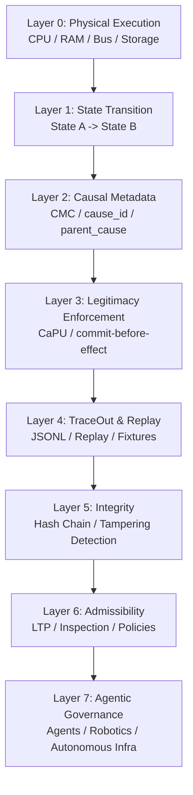
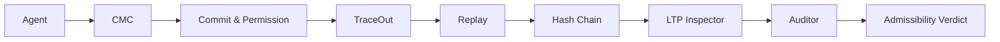

# Causal Execution Architecture

Status: architecture map / system identity.

## Foundational thesis

```text
Traditional computing verifies state transitions.
Causal computing verifies transition legitimacy.
```

CMC, CaPU, TraceOut, Replay, Hash Chain, and LTP form an early stack for replayable, inspectable, and admissible agentic execution.

---

## Layered architecture



---

## Ordinary vs causal execution

Ordinary execution:

```text
input -> computation -> output
```

Causal execution:

```text
input -> cause -> permission -> commit -> effect -> trace -> replay -> legitimacy verification
```

Ordinary systems mainly ask what changed.
Causal systems ask whether the change had the right to happen.

---

## System flow



---

## Core concepts

### Causal memory

```text
Memory is not only storage.
Memory becomes lineage.
```

CMC introduces:

- cause_id
- parent_cause
- permission lineage
- commit state
- replay-oriented transitions

### Replayable legitimacy

Replay is not only about reproducing outputs.
It is about reconstructing why the system believed it had the right to act.

### Tamper-evident replay

```text
TraceOut -> Hash Chain -> Verification -> Tampering Detection
```

---

## Comparison

| System | Main property |
| --- | --- |
| CPU | Executes instructions |
| RAM | Stores state |
| Logs | Record events |
| Blockchain | Preserves transaction history |
| CMC | Preserves causal legitimacy |
| LTP | Verifies admissible replay continuity |

---

## Emerging primitive

```text
legitimate transition history
```

This becomes the new object of verification: not merely what changed, but whether the change had the right to happen.

---

## Strategic positioning

```text
Blockchain protects transaction history.
CMC protects causal legitimacy.
```

```text
The next generation of agentic systems will require not only memory,
but legitimacy-preserving memory.
```

---

## System identity

This project is not a chatbot, logging framework, blockchain clone, memory cache, or observability dashboard.

It is evolving toward:

```text
causal execution infrastructure
```

and eventually:

```text
legitimacy-preserving computation
```

---

## Canonical note

```text
We are building causal execution infrastructure.

The core primitive is legitimate transition history:
not only what changed,
but whether the change had the right to happen.

Traditional computing verifies state transitions.
Causal computing verifies transition legitimacy.

Blockchain protects transaction history.
CMC protects causal legitimacy.
```
